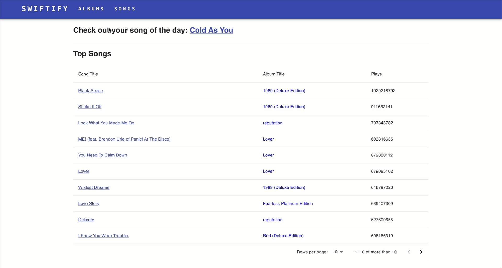
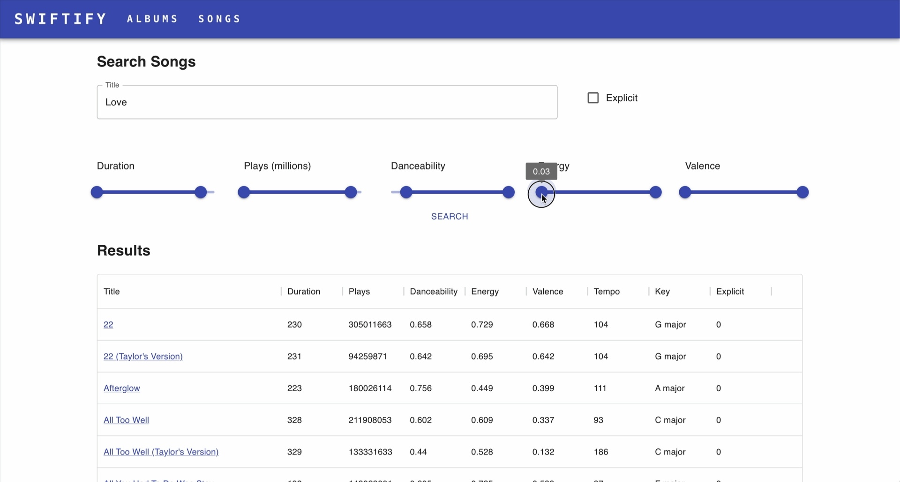
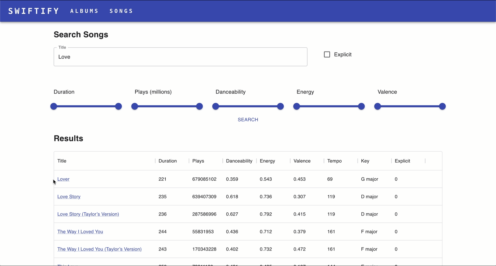
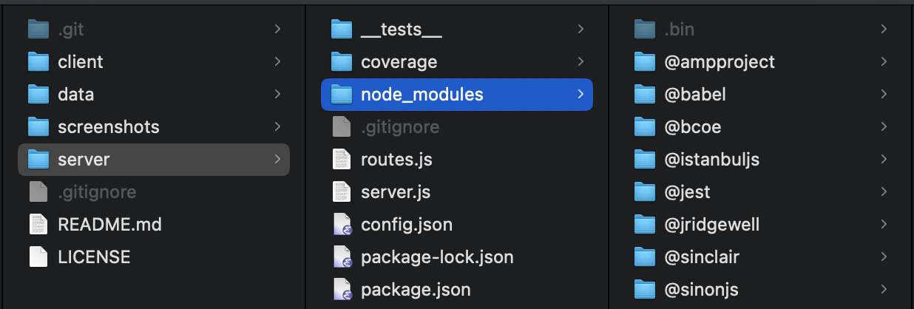
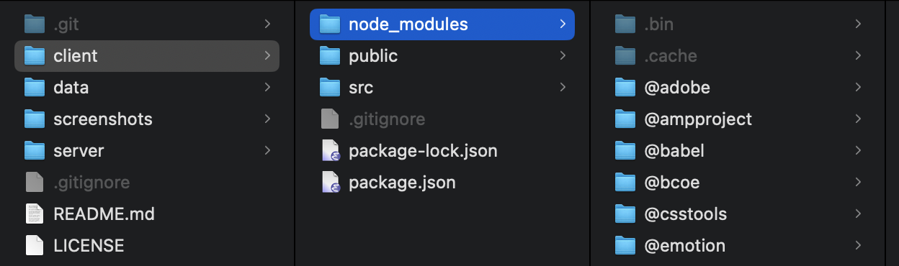

# 🎧 Spotify WebDB Application

A full-stack music data exploration platform developed in React + Node.js, integrated with a PostgreSQL RDS backend. This project demonstrates dynamic querying, data visualization, and backend API design. Designed as part of CIS 5500: Database and Information Systems coursework.


## 🔧 Tech Stack
- Database: PostgreSQL on AWS RDS
- Frontend: React.js, MUI (Material UI), Recharts
- Backend: Node.js + Express, REST API with route handlers
- Visualization: Recharts (RadarChart, BarChart)
- Dev Tools: VS Code, Git, Chrome DevTools, DataGrip, npm


## 📂 Project Structure

This project contains separate folders for the backend (Node.js + PostgreSQL) and frontend (React + MUI), each with its own documentation:

- [`server/`](./server) – Node.js + Express backend with API routes and PostgreSQL. 👉 [Backend README](./server/README.md)

- [`client/`](./client) – React frontend with MUI components and dynamic visualizations. 👉 [Frontend README](./client/README.md)

- [`data/`](./data) – Source CSV files used to populate the database. 👉 [Dataset Description](./data/README.md)


## ✨ Features
- Powerful search filters: by title, duration, plays, energy, valence, danceability, etc.
- Top albums/songs ranking with pagination
- Song detail page with dynamic bar chart and radar chart 
- Pagination support and lazy-loaded tables for performance


## 📸 Website Preview

### 💿 **Home Page**: 

Default landing page (`/`), random “Song of the Day”, Top Songs table, and Top Albums table.



### 💿 **Search Songs Page**:

Click "SONGS" in the top navigation bar, show filters (sliders, text input, explicit checkbox), and the results table



### 💿 **Song Details Page (Radar Chart)**:

Click on any song title in Home or Album pages, popup page showing song metadata, user can toggle between bar and radar chart




### 💿 **Albums Page**:

Click "ALBUMS" in the top navigation bar, user can see grid layout of album cards with covers and album titles


### 💿 **Album Info Page**:

Click on an album from the Albums page | Album cover, title, release date, and track list in a table 


## 🚀 Getting Started

### 1. Clone and install server dependencies
This will download and save the required dependencies into the `node_modules` folder within the `/client` and `/server` directories.

```bash
cd server
npm install
```



Then start the server
```bash
npm start
```


### 2. In another terminal, install client dependencies

```bash
cd ../client
npm install
```




Start React frontend
```bash
npm start
```

### 3. Access the app in your browser

The app will run at:
- Frontend: http://localhost:3000
- Backend: http://localhost:8080
