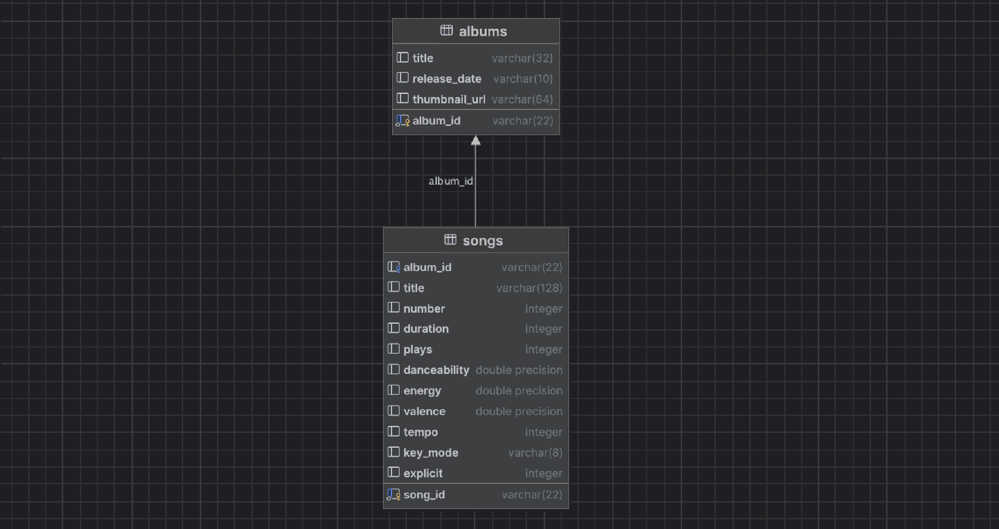

# 📊 Dataset Description

This folder contains the raw data files used to populate the PostgreSQL database for the Web DB project.

Data Loading: 

ER Diagram:

## 💿 Albums.csv

Contains metadata for music albums.

| Column         | Description                         |
|----------------|-------------------------------------|
| `album_id`     | Unique identifier for the album     |
| `title`        | Album title                         |
| `release_date` | Date when the album was released    |
| `thumbnail_url`| URL to the album's thumbnail image  |

---

## 🎵 Songs.csv

Contains detailed metadata for individual tracks.

| Column         | Description                               |
|----------------|-------------------------------------------|
| `song_id`      | Unique identifier for the song            |
| `album_id`     | Foreign key linking to Albums.csv         |
| `title`        | Track title                               |
| `number`       | Track number on the album          |
| `duration`     | Length of the song in seconds             |
| `plays`        | Total play count                          |
| `danceability` | Float (0–1) — how danceable the song is   |
| `energy`       | Float (0–1) — perceived energy level       |
| `valence`      | Float (0–1) — how happy or positive it is |
| `tempo`        | Beats per minute (BPM)                    |
| `key_mode`     | Key and mode (e.g. C major, A minor)      |
| `explicit`     | 1 if explicit content, 0 otherwise         |

